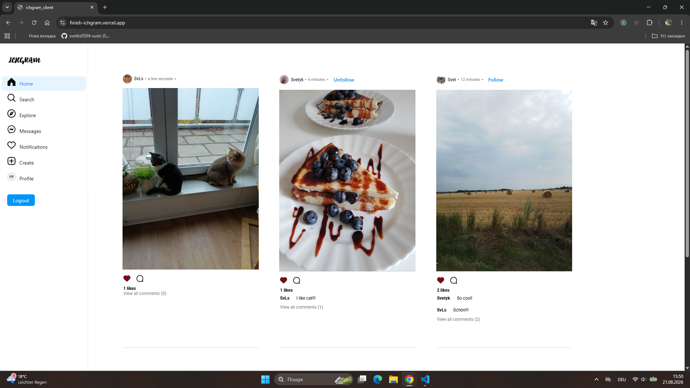
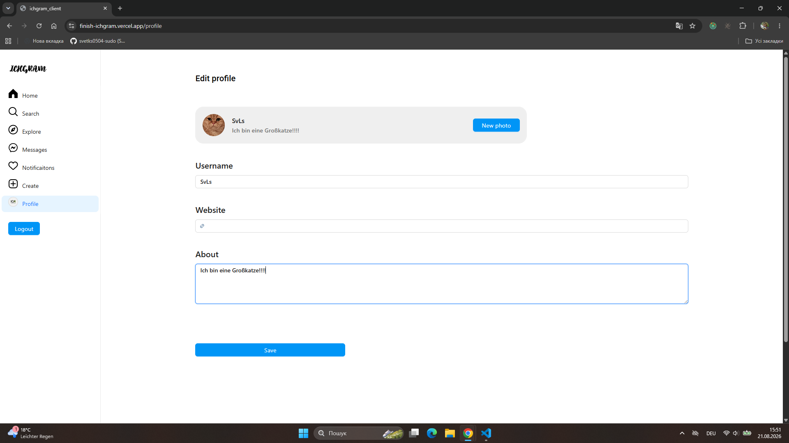
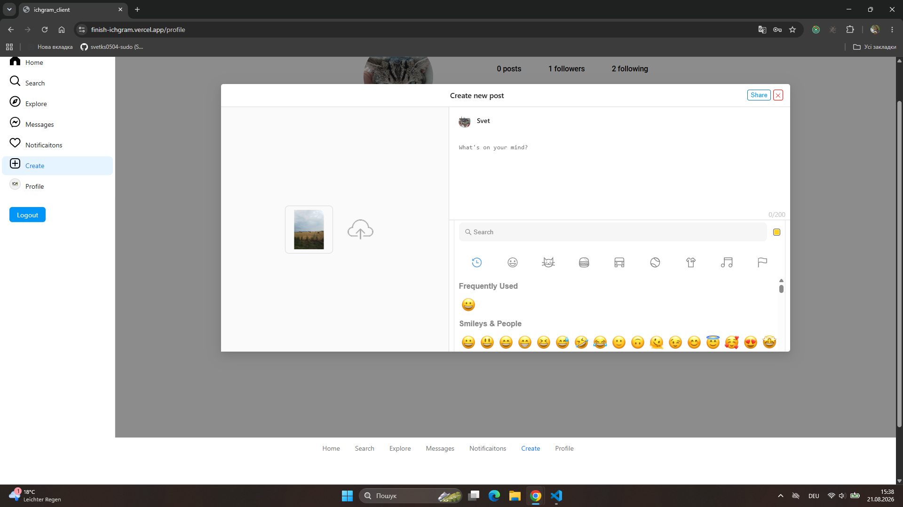
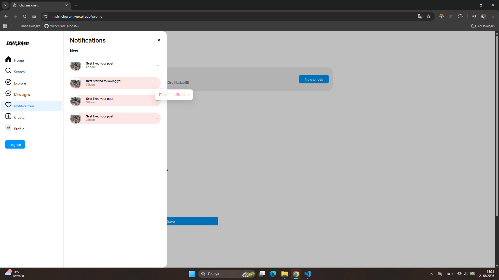
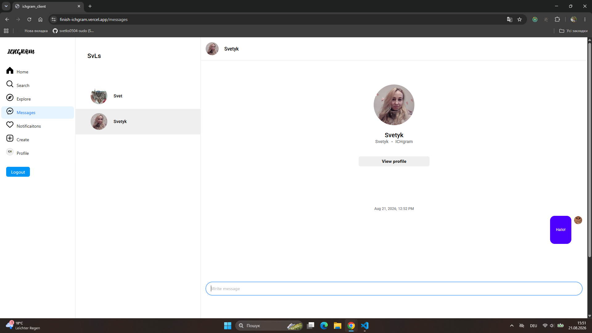
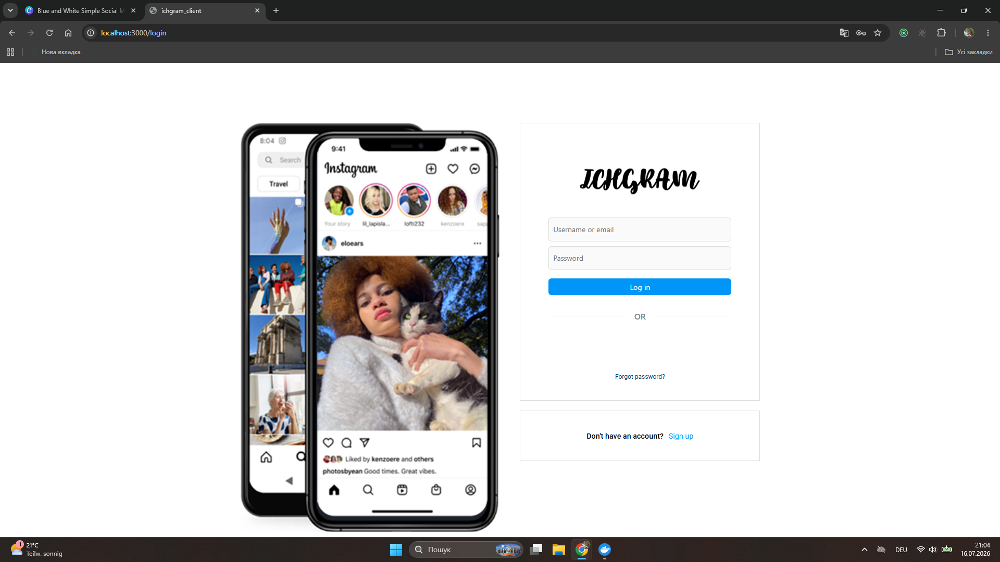

# ICHgram — Full-stack Social Media Application

Full-stack social media application built with React, Node.js, Express, MongoDB and Socket.IO.

Inspired by Instagram, the application allows users to create posts, interact with other users, follow profiles, exchange real-time messages and receive notifications.

## 🚀 Live Demo

**Frontend:** https://finish-ichgram.vercel.app/login
**Backend:** https://finish-ichgram.onrender.com

## ✨ Features

* 🔐 User registration and login
* 🔑 Password recovery via email (implemented and available in the local environment; disabled in the deployed version due to free hosting limitations).
* 👤 User profiles and profile editing
* 📸 Create, edit, and delete posts with images
* ❤️ Like and unlike posts
* 💬 Create and delete comments
* 👥 Follow and unfollow users
* 🔔 Notifications for likes, comments, and follows
* 💬 Real-time chat
* 🔎 Search users
* 🖼️ User avatars and post images
* 📱 Responsive interface

## 🛠️ Tech Stack

### Frontend

* React
* Redux Toolkit
* React Router
* Ant Design
* Axios
* Socket.IO Client
* Vite

### Backend

* Node.js
* Express
* MongoDB
* Mongoose
* JWT
* bcrypt
* Multer
* Nodemailer
* Socket.IO

## 🌐 Deployment

Frontend
React + Vite → Vercel

Backend
Node.js + Express → Render

Database
MongoDB → MongoDB Atlas

Real-time
Socket.IO → Frontend ↔ Backend

## 🏗️ Project Structure

ICHgram/
├── client_ichgram/      # React frontend
├── server_ichgram/      # Node.js / Express backend
├── docker-compose.yaml
└── README.md

## ⚙️ Run Locally

 1. Clone the repository
git clone https://github.com/svetks0504-sudo/finish_ichgram
cd finish_ichgram

 2. Start with Docker
docker compose up --build

The application will be available at:
http://localhost:3000

The backend runs on:
http://localhost:3333

### 3. Environment Variables
Create the required `.env` files based on the provided `.env.example` files.

Example backend variables:

DB_URI=your_mongodb_connection_string
JWT_SECRET=your_jwt_secret
EMAIL=your_email
EMAIL_PASS=your_email_password
CLIENT_URL=your_client_url

## 🔌 Real-Time Communication

Socket.IO is used for real-time chat functionality.

The server handles:

* user connections;
* chat rooms;
* message sending;
* loading chat history;
* real-time message delivery.

## 📸 Screenshots

### Home Feed

### Edit User Profile

### Create Post

### Notifications

### Real-Time Chat

### Login

## 👩‍💻 Author

**Svitlana Mazorchuk**

Web Development Weiterbildung — IT Career Hub
